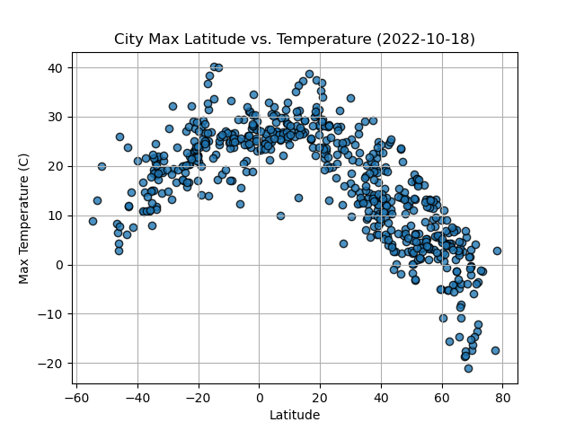

# Python-API-Challenge

"What is the weather like as we approach the equator?"

By taking Python requests, APIS, and JSON traversals, I am able to answer the question above.
The two deliverables WeatherPy and VacationPy hold a created Python script to visualize the weather of over 500 cities of varying distances from the equator and to plan future vacations using Jupyter notebooks, geoViews Python library, and the Geoapify API.